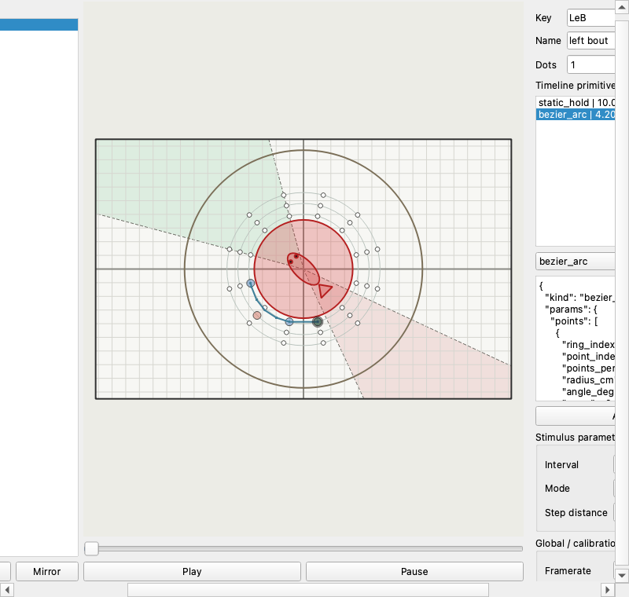
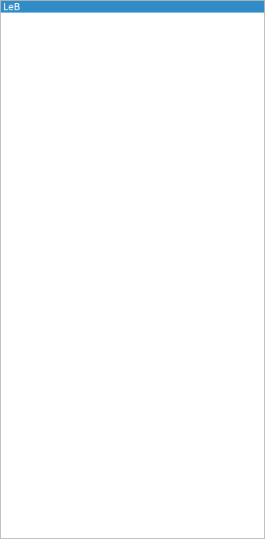
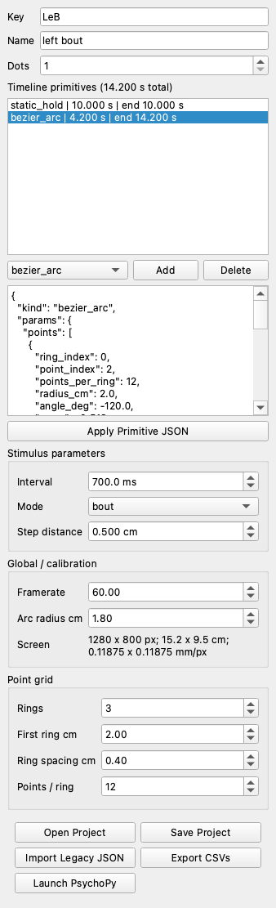
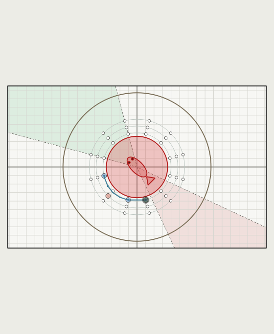
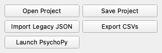

# Stimulus Designer

This repository contains a graphical program for designing visual stimuli for fish behavior or imaging experiments. You can build stimuli from simple primitives, preview them on a calibrated screen, export frame-by-frame trajectory CSV files, and optionally play those files with PsychoPy.

The project is now focused only on stimulus design. Older neural-analysis notebooks and tools are no longer part of this repository.

## What You Can Do

- Design one or more stimuli in a point-grid GUI.
- Add primitives such as static holds, flicker, rocking, linear paths, Bezier arcs, gratings, and looms.
- Preview the fish-centered field, avoidance circle, petri dish guide, and stimulus motion.
- Save and reopen editable stimulus projects.
- Export trajectory CSV files for experiments.
- Launch PsychoPy to play exported trajectories on a projection display.

## Install

These steps assume you are starting from scratch.

### 1. Install Conda

Install Miniconda or Anaconda if you do not already have it:

- Miniconda: https://docs.conda.io/en/latest/miniconda.html
- Anaconda: https://www.anaconda.com/download

### 2. Get This Repository

Download or clone this repository, then open a terminal in the repository folder.

```bash
cd path/to/ddharmap-stimulusDesigner
```

The Conda environment is still named `social_filters`; that name does not need to match the repository folder.

### 3. Create The Environment

```bash
conda env create -f environment.yml
conda activate social_filters
pip install -e .
```

If the environment already exists and you want to update it:

```bash
conda env update -f environment.yml --prune
conda activate social_filters
pip install -e .
```

PsychoPy is optional. You only need it if you want to present stimuli full-screen from this computer. If PsychoPy is not installed, you can still design projects and export CSV files.

## Start The Program

```bash
conda activate social_filters
python scripts/stimuli/stimulus_designer_app.py
```

The GUI reopens the last project you opened or saved. If that file has moved, the program falls back to a new blank project.



## Basic Workflow

### 1. Create Or Open A Project

Use the left stimulus list to manage stimuli. Add new stimuli, duplicate existing ones, delete stimuli, or drag entries up and down to change their order.



Use:

- `Open Project` to load an editable project JSON.
- `Save Project` to save the current editable project.
- `Import Legacy` only for older stimulus JSON files.

### 2. Add A Primitive

Select a stimulus, choose a primitive type, then click `Add Primitive`.

Common primitives:

- `static_hold`: one dot held at one grid point.
- `flicker`: one dot flickering at one grid point.
- `rocking`: alternates between two selected points.
- `point_path`: visits any number of selected points.
- `linear`: steps along a line from start to end.
- `bezier_arc`: uses start, end, and control/widest point to create a curved path.
- `whole_field_grating`: moving grating across the screen.
- `loom`: expanding circle at one point.



### 3. Choose Points

Click points on the preview grid to assign positions to the selected primitive. The number of points depends on the primitive:

- one point for `static_hold`, `flicker`, and `loom`
- two points for `rocking`, `linear`, and grating direction
- three points for `bezier_arc`
- any number for `point_path`

The primitive JSON box shows the exact saved parameters.

### 4. Preview The Stimulus

Use the preview controls to play or pause the stimulus preview. Scroll over the preview to zoom, and right-drag to pan while zoomed.

The preview includes:

- fish center
- calibrated screen boundary
- placement rings and point grid
- 18 mm avoidance zone around the fish
- 8.7 cm petri dish guide
- visual field guides



### 5. Export CSVs

Click `Export CSVs` when you are ready to generate experiment files.

This writes:

- one `<stimulus_key>_trajectory.csv` per stimulus
- `parameters/experiment_parameters.csv`
- `parameters/total_time_sec.csv`
- `parameters/stimulus_designer_project.json`

The trajectory CSV files are the durable frame-by-frame stimulus instructions. Keep these files with your experiment records.

### 6. Launch PsychoPy

Click `Launch PsychoPy` to play an already-exported stimulus folder.

PsychoPy:

- loads existing `*_trajectory.csv` files
- opens a full-screen presentation window
- draws dots, gratings, and looms frame by frame
- writes `stimulus_timing_log.csv` with actual playback start/end times

Use `Export CSVs` first after changing a project. Use `Launch PsychoPy` when you want to present the exported files.



## Output Files

### Editable Project

`stimulus_designer_project.json` stores the project in an editable form. Use this file with `Open Project`.

### Trajectory CSVs

`*_trajectory.csv` files contain frame-by-frame positions and radii. Dot columns use:

- `dot0_x`
- `dot0_y`
- `dot0_radius`

Some visual primitives add extra columns, such as:

- `grating_active`
- `grating_direction_deg`
- `grating_phase_cm`
- `loom_active`
- `loom_radius`

### Metadata

`parameters/experiment_parameters.csv` summarizes exported stimuli.

`parameters/total_time_sec.csv` estimates total experiment duration from exported stimulus durations and pause settings.

### Playback Timing

`stimulus_timing_log.csv` is created by PsychoPy playback. It records the actual wall-clock start and end time for each played trajectory file.

## Regenerate README Screenshots

Screenshots are stored under `docs/images/`. To regenerate them, use a computer where the Conda environment has PyQt6 installed:

```bash
conda activate social_filters
python scripts/docs/capture_gui_screenshots.py
```

The script opens the GUI with a small sample project and saves the README screenshots. The committed PNG files were generated with this script; rerun it after GUI layout changes.

## Troubleshooting

### `PyQt6 is required`

Activate the Conda environment:

```bash
conda activate social_filters
```

If PyQt6 is still missing, update the environment:

```bash
conda env update -f environment.yml --prune
```

### PsychoPy Is Missing

You can still design stimuli and export CSVs. Install PsychoPy only on the computer used for live stimulus presentation.

### PsychoPy Says No Trajectory CSVs Were Found

Click `Export CSVs` first and choose the same folder when launching PsychoPy.

### The Full-Screen Display Opens On The Wrong Monitor

Projection display setup is controlled in `scripts/stimuli/try_projection.py`. The default launch path uses its default screen settings. Adjust the PsychoPy screen index there if your hardware setup needs a different display.

## Developer Checks

```bash
python -m pytest tests/test_stimulus_designer.py tests/test_stimulus_designer_app.py -q
python -m py_compile src/stimulus_designer.py scripts/stimuli/stimulus_designer_app.py scripts/stimuli/try_projection.py
```
